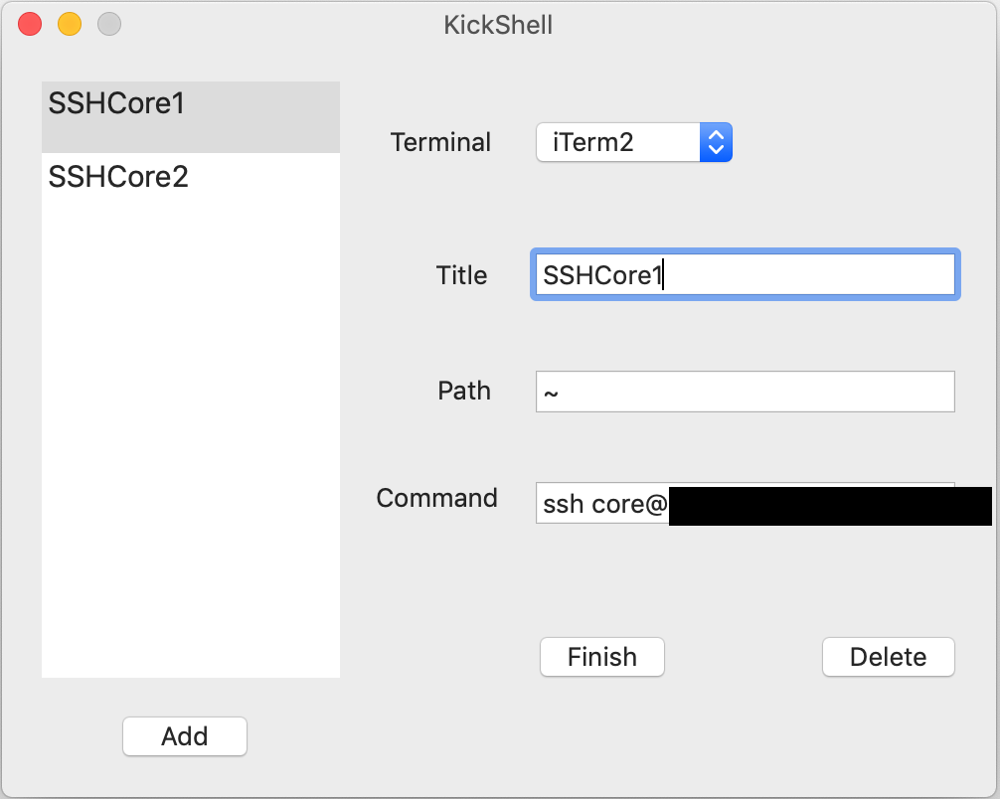
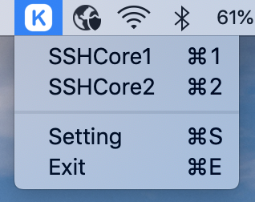

# KickShell
Simple Mac APP, use StatusBar-click instead of writing shell command.

## Operating Stpes
1: Click StatusBar "K" icon, Open setting.<br>
2: Click "Add" button to add a item and Click "Finish" button to save.
```
Terminal: Which Termianl that want to use. Support iTerm2 and System Terminal.
Title: the title of this item.
Path: Which path that run the shell command.
Command: The shell command.
```

Below item means: cd to "~" folder than shh connect to a remote machine.<br>
 <br>
3: Click StatusBar to run the command:<br>


## Download APP
The "Released" folder contains a Builded APP.
